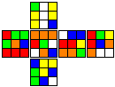

# TNoodle CLI
Generate WCA scrambles for the Rubik's Cube and other twisty puzzles on the command line!

**What?**

[TNoodle](https://www.worldcubeassociation.org/regulations/scrambles/) is the official scrambling program used by the World Cube Association (the "WCA") in official Rubik's Cube Speedsolving Competitions.
This project provides a Command Line Interface (CLI) for the same core scramble generator engine used for generating official scrambles.

**Why?**

The core TNoodle engine is a Java library, which makes it difficult to incorporate into programs written in other programming languages.
However, since most programming languages can invoke system calls, they can invoke this CLI to obtain competition quality scrambles and drawings for all official WCA puzzles and events.


## Installation
You can get the TNoodle CLI for Windows, Linux, and Mac on the [releases](https://github.com/jhale1805/tnoodle-cli/releases) page.
Simply download the version corresponding to your operating system and extract the archive contents to a convenient place in your file system.
Open a terminal in the `bin` folder of the extracted package and you're ready to go.
- Alternatively, if you know what you're doing, you can add that `bin` folder to your system PATH to have the `tnoodle` command available system wide.

If there isn't a distribution for your operating system, feel free to [open an issue](https://github.com/jhale1805/tnoodle-cli/issues/new) requesting its addition to the release pipeline.
In the meantime, as long as you have Java 11 or higher, you can directly use the core `.jar` file also available on the releases page.

## Usage
The tool itself contains detailed documentation for its use.
```bash
tnoodle --help
```

The core commands are:
- `puzzles`: Lists all the puzzles for which the WCA, and thus this CLI
tool, provide scramble generators.
- `scramble`: Generates one or more scrambles for a specific puzzle type
- `draw`: Generates an svg image of a particular scramble.

 * This design decision makes it easier to maintain this CLI tool as different puzzles and scrambling algorithms are added/removed from the official scrambler.

*NOTE: If you are using the core `.jar` file, swap out the `tnoodle` command for `java -jar tnoodle-cli-VERSION.jar` in this and the following examples.*

### Examples
#### Generating a single 3x3 scramble:
```
> tnoodle scramble
D L' U L U2 L' U2 B U' R' F2 R L' D2 L D2 F2 L
```

#### Generating a single 4x4 scramble:
```
> tnoodle scramble --puzzle four
L' F B2 L F2 B2 L' F2 L2 R B2 U' B' D' L2 D' F2 B2 R2 Fw2 U Rw2 Uw2 R' U' Rw2 R D2 B2 Rw2 Fw2 L Fw' F B2 Uw' D L Uw2 Rw' D Rw' U'
```

#### Generating five Skewb scrambles in JSON format:
```
> tnoodle scramble --puzzle skewb --count 5 --output "skewb.json"
> cat skewb.json
[
  "L B L B' L' U R B L' B L",
  "L U R B U B R' B L B R",
  "B U L' U' L R' B R' B U L'",
  "B L U B' U' B' L B' L U' R'",
  "B R U' B' U L U' L' B' U' L"
]
```
#### Creating SVG images of scrambles
```
> tnoodle draw --puzzle three --scramble "D L' U L U2 L' U2 B U' R' F2 R L' D2 L D2 F2 L" --output three.svg
```


## Legal
***Disclaimer:** This CLI tool is an **unofficial** project currently unaffiliated with the WCA. Scrambles generated by this tool are NOT authorized for use in any official WCA event. All such scrambles must be generated using the [official TNoodle program](https://www.worldcubeassociation.org/regulations/scrambles/).*

### License
This tool is licensed under the GPLv3 because its primary dependency, the official WCA `tnoodle-lib`, is licensed under the GPLv3. This means that you have full freedom to use, modify, and redistribute this tool, provided that you do so under these same license terms. See the `LICENSE.md` for the full legal details.

Note, however, that this CLI tool can be aggregated into a larger collection of programs without the whole collection being deemed a "derivative work" that must be redistributed under the terms of the GPLv3. See these Frequently Asked Questions (FAQs) from the Free Software Foundation (FSF) --the author of the GPLv3 license-- for more details:
- https://www.gnu.org/licenses/gpl-faq.html#RequireCitation
- https://www.gnu.org/licenses/gpl-faq.html#GPLOutput
- https://www.gnu.org/licenses/gpl-faq.html#WhatCaseIsOutputGPL

